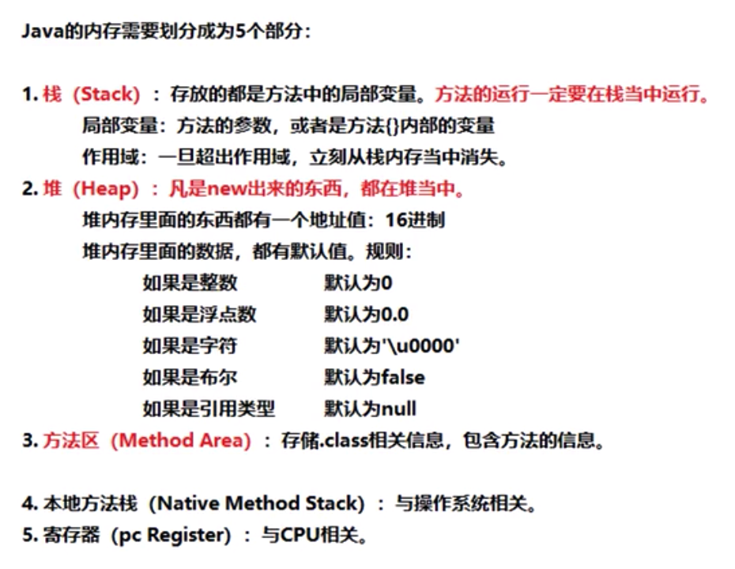
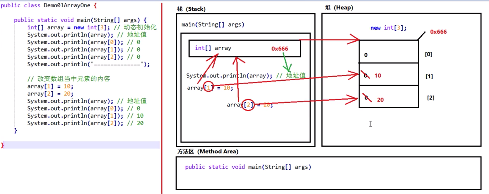
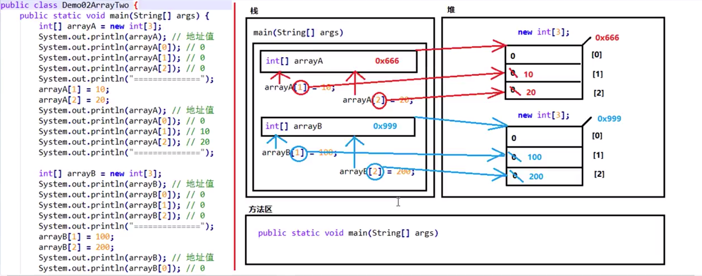
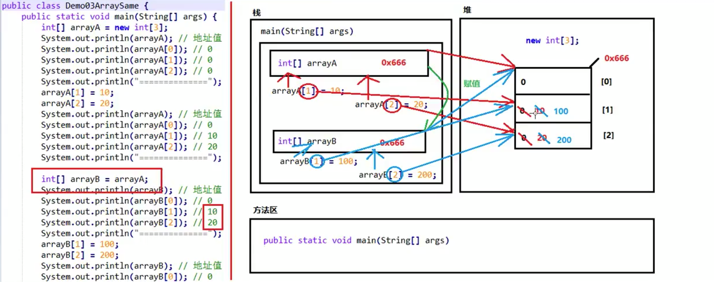

# 第一章 数组
## 1.1 数组的概念
## 1.2 Java中的内存划分

## 1.3 数组的内存图
- 一个数组的内存图

- 两个数组的内存图

- 当两个数组指向同一个地址时

## 1.4 获取数组的长度
- 数组名称.length
## 1.5 遍历数组
`Demo09Array`
- 遍历数组：说的就是对数组当中的每一个元素进行逐一、挨个处理，默认处理方式是打印输出。
## 1.6 求出数组当中的最值
`Demo10ArrayMax`
## 1.7 数组元素的反转
`Demo11ArrayReverse`
