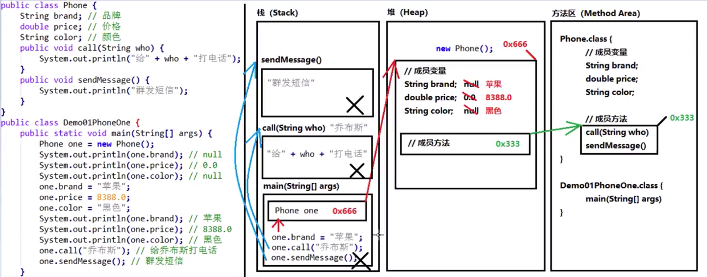

# day06[类与对象、封装、构造方法]
# 第一章 面向对象的思想
## 1.1 面向对象思想的概述
- 特点：面向对象思想是一种更符合我们思考习惯的思想，它可以将复杂的事情简单化
并将我们从执行者变成了指挥者。面向对象的语言中，包含
三大基本特征，即封装、继承、多态。
## 1.2 类和对象
> 环顾周围，你会发现很多对象，比如桌子椅子同学，老师等
>桌椅属于办公用品，师生都是人类，那么什么是类呢？什么是对象呢？

- **什么是类**
    + 类：是一组相关的属性和行为的集合。可以看成是
    一类事物的模板，使用事物的属性特征和行为特征来描述
    该类事物。
    
    现实中描述一类事物：
    + 属性：就是该事物的状态信息。
    + 行为：走、跑、叫
    
    举例：小猫
    + 属性：名称、体重、年龄、颜色
    + 行为：走、跑、叫
 - 什么是对象
    + 对象：是一类事物的具体体现。对象是类的一个实例，必然
    具备该类事物的属性和行为。
    
    现实中，一类事物的一个实例：一只小猫
    
    举例：一只小猫
    + 属性：tom、5KG、2year、yellow
    + 行为：溜墙根走、蹦跶跑、喵喵叫
 - 类与对象的关系
    + 类是对一类事物的描述，是抽象的。
    + 对象是一类事物的实例，是具体的。
    + 类是对象的模板，对象是类的实体。
 
 ## 1.3 类的定义
 - 事物与类的对比：
    + 现实世界的一类事物：
        * 属性：事物的状态信息。
        * 行为：事物能够做什么。
    + java中用class描述事物也是如此：
        * 成员变量：对应事物的属性。
        * 成员方法：对应事物的行为。
 - 类定义的格式
```
public class ClassName {
    // 成员变量
    // 成员方法
}
```
- 定义类：就是定义类的成员，包括成员变量和成员方法。
- 成员变量：和以前定义变量几乎是一样的，只不过位置发生了改变，在类中，方法外。
- 成员方法：和以前定义方法几乎是一样的，只不过把static去掉，static的作用在面向对象后面
课程中再详细讲解。
## 1.4 一个对象的内存图

## 1.5 两个对象使用同一个方法的内存图

## 1.6 两个对象指向同一个对象的内存图

## 1.7 用户对象类型作为方法的参数

## 1.8 对象类型作为方法的返回值

## 1.9 成员变量和局部变量的区别
- (1).定义的位置不一样【重点】
    + 局部变量：在方法的内部。
    + 成员变量：在方法的外部，直接写在类中。
- (2).作用范围不一样【重点】
    + 局部变量：只有方法当中可以使用。
    + 成员变量：整个类全都可以使用。
- (3).默认值不一样【重点】
     + 局部变量：没有默认值，如果想要使用，必须手动进行赋值。
     + 成员变量：如果没有赋值，规则和数组一样，会有默认值。
- (4).内存位置不一样【了解】
     + 局部变量：位于栈内存。
     + 成员变量：位于堆内存。
- (5).生命周期不一样【了解】
     + 局部变量：随着方法进栈而诞生，随着方法出栈而消失。
     + 成员变量：随着对象创建而诞生，随着对象被垃圾回收而消失。
## 第二章 封装
## 2.1 封装概述
- 面向对象的三大特征：封装、继承、多态
- 封装在java中的体现：
    + 1.方法就是一种封装
    + 2.关键字private也是一种封装
- 封装就是将一些细节信息隐藏起来，对外界不可见。