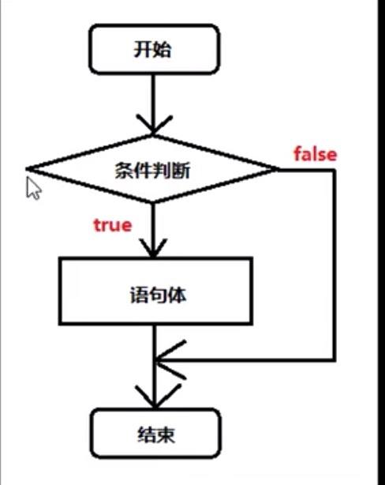
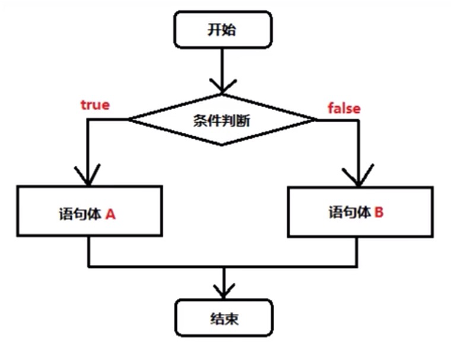
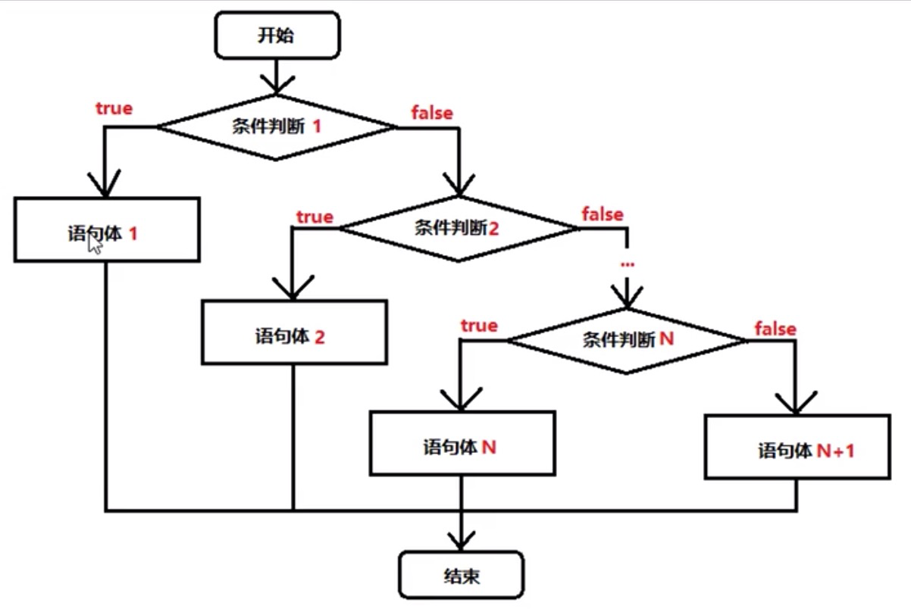

# 第一章 流程控制
## 1.1 概述
在一个程序执行的过程中，各条语句的执行顺序对程序的结果是有直接影响的，也就是说，程序的流程
对运行的结果有直接的影响。所以，我们必须清楚每条语句的执行流程，而且很多时候我们要通过控制
语句的执行顺序来实现我们要完成的功能。
## 1.2 顺序结构
```java
public class Demo01 {
    public static void main(String[] args) {
        // 顺序执行，根据编写的顺序，从上到下运行
        System.out.println(1);
        System.out.println(2);
        System.out.println(3);
    }
}
```
# 第二章 判断语句
## 2.1 判断语句1 -- if
- if语句的第一种格式：if
```
if(关系表达式) {
    语句体；
}
```
- 执行流程
    + 首先判断关系表达式看其结果是true还是false
    + 如果是true就执行语句体
    + 如果是false就不执行语句体
    

## 2.2 判断语句2 -- if...else
- if语句的第一种格式：if...else
```
if(关系表达式) {
    语句体1；
} else {
    语句体2；
}
```
- 执行流程
    + 首先判断关系表达式看其结果是true还是false
    + 如果是true就执行语句体1
    + 如果是false就执行语句体2
    
 
 ```java
public class Demo03 {
    public static void main(String[] args) {
        // 判断给定的数据是奇数还是偶数
        // 定义变量
        int a = 1;
        if (a % 2 == 0) {
            System.out.println("a是偶数");
        } else {
            System.out.println("a是奇数");
        }
        System.out.println("结束");
    }
}
```
## 2.3 判断语句3 -- if...else if...else
- if语句的第一种格式：if...else if...else
```
if(判断条件1) {
    执行语句1；
} else if(判断条件2) {
    执行语句2；
}
...
} else if(判断条件n) {
    执行语句n；
} else {
    执行语句n+1；
}
```
- 执行流程
    + 首先判断关系表达式1看其结果是true还是false
    + 如果是true执行语句体1
    + 如果是false就继续判断关系表达式2看其结果是true还是false
    + 如果true就执行语句体2
    + 如果false就继续判断关系表达式...看其结果是true还是false
    + ...
 
 ```java
public class Demo04 {
    public static void main(String[] args) {
        // x和y的关系满足如下
        // 如果 x >= 3 那么 y = 2 * x + 1;
        // 如果 x >= -1 && x < 3 那么 y = 2 * x;
        // 如果 x <= -1 那么 y = 2 * x - 1;
        // 根据给定的x的值，计算出y的值并输出
        // 定义变量
        int x = 5;
        int y;
        if (x >= 3) {
            y = 2 * x + 1;
        } else if(x >= -1 && x < 3) {
            y = 2 * x;
        } else {
            y = 2 * x - 1;
        }
        System.out.println("y的值是：" + y);
    }
}
```
## 2.4 语句练习
- 指定考试成绩，判断成绩的等级
    + 90-100 优秀
    + 80-89 好
    + 70-79 良
    + 60-69 及格
    + 60以下 不及格
 ```java
public class Demo05 {
    public static void main(String[] args) {
        int score = 100;
        if (score < 0 || score > 100) {
            System.out.println("你的成绩是错误的");
        } else if (score >= 90 && score <= 100) {
            System.out.println("你的成绩属于优秀");
        } else if (score >= 80 && score <= 89) {
            System.out.println("你的成绩属于好");
        } else if (score >= 70 && score <= 79) {
            System.out.println("你的成绩属于良");
        } else if (score >= 60 && score <= 69) {
            System.out.println("你的成绩属于及格");
        } else {
            System.out.println("你的成绩属于不及格");
        }
    }
}
```
## 2.5 if语句和三元运算符的交换
```java
public class Demo06 {
    public static void main(String[] args) {
        int a = 105;
        int b = 20;
        // 首先使用三元运算符
        int max = a > b ? a : b;
        
        // 使用if语句
        if(a > b) {
            max = a;
        } else {
            max = b;
        }
        System.out.println("最大值：" + max);
    }
}
```
# 第三章 选择语句
## 3.1 选择语句 -- switch
- switch语句格式
```
switch(表达式) {
    case 常量值1:
        语句体1；
    break;
    case 常量值2:
        语句体2；
    break;
    ...
    default:
        语句体n+1;
    break;
}
```
- 执行流程
    + 首先计算出表达式的值
    + 其次，和case依次进行比较，一旦有对应的值就会执行相应的语句，在执行的过程中，遇到break就会结束。
    
## 3.2 case的穿透性
# 第四章 循环语句
## 4.1 循环概述
## 4.2 循环语句1 -- for
## 4.3 循环语句2 -- while
## 4.4 循环语句3 -- do...while
## 4.5 循环语句的区别
## 4.6 跳出语句
# 第五章 扩展知识点
## 5.1 死循环
## 5.2 嵌套循环
# 44