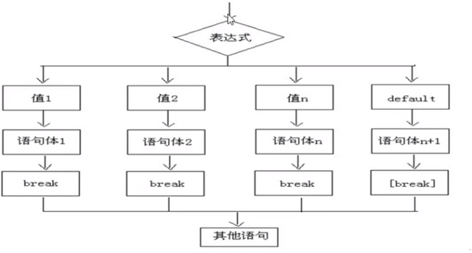
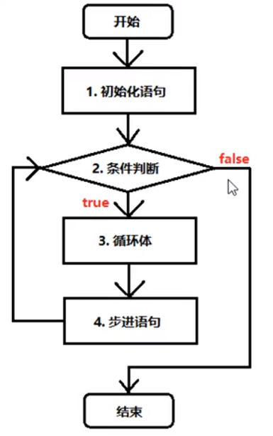
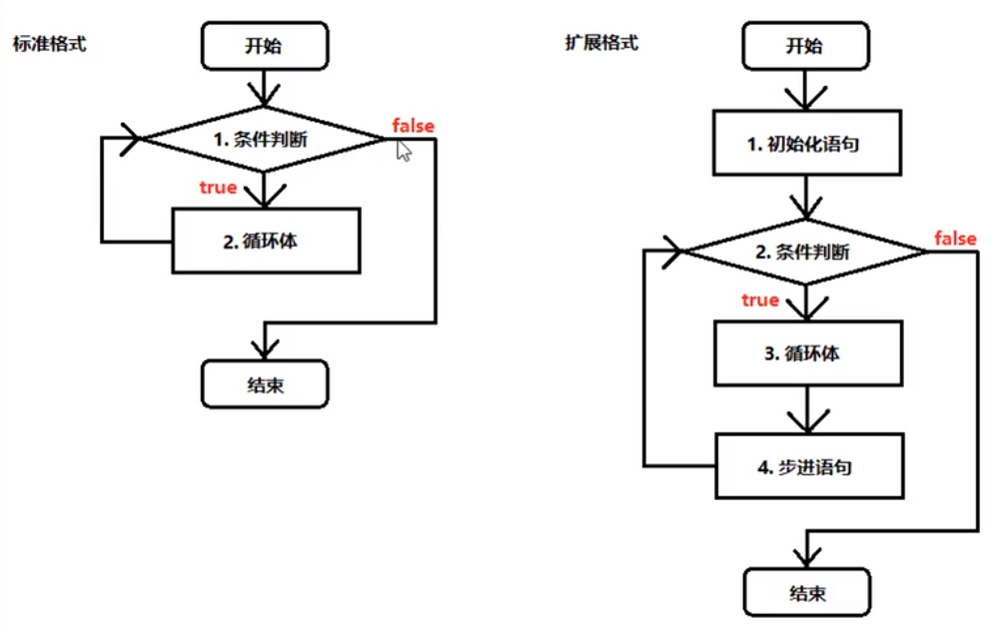

# 第一章 流程控制
## 1.1 概述
在一个程序执行的过程中，各条语句的执行顺序对程序的结果是有直接影响的，也就是说，程序的流程
对运行的结果有直接的影响。所以，我们必须清楚每条语句的执行流程，而且很多时候我们要通过控制
语句的执行顺序来实现我们要完成的功能。
## 1.2 顺序结构
```java
public class Demo01 {
    public static void main(String[] args) {
        // 顺序执行，根据编写的顺序，从上到下运行
        System.out.println(1);
        System.out.println(2);
        System.out.println(3);
    }
}
```
# 第二章 判断语句
## 2.1 判断语句1 -- if
- if语句的第一种格式：if
```
if(关系表达式) {
    语句体；
}
```
- 执行流程
    + 首先判断关系表达式看其结果是true还是false
    + 如果是true就执行语句体
    + 如果是false就不执行语句体
    

## 2.2 判断语句2 -- if...else
- if语句的第一种格式：if...else
```
if(关系表达式) {
    语句体1；
} else {
    语句体2；
}
```
- 执行流程
    + 首先判断关系表达式看其结果是true还是false
    + 如果是true就执行语句体1
    + 如果是false就执行语句体2
    
 
 ```java
public class Demo03 {
    public static void main(String[] args) {
        // 判断给定的数据是奇数还是偶数
        // 定义变量
        int a = 1;
        if (a % 2 == 0) {
            System.out.println("a是偶数");
        } else {
            System.out.println("a是奇数");
        }
        System.out.println("结束");
    }
}
```
## 2.3 判断语句3 -- if...else if...else
- if语句的第一种格式：if...else if...else
```
if(判断条件1) {
    执行语句1；
} else if(判断条件2) {
    执行语句2；
}
...
} else if(判断条件n) {
    执行语句n；
} else {
    执行语句n+1；
}
```
- 执行流程
    + 首先判断关系表达式1看其结果是true还是false
    + 如果是true执行语句体1
    + 如果是false就继续判断关系表达式2看其结果是true还是false
    + 如果true就执行语句体2
    + 如果false就继续判断关系表达式...看其结果是true还是false
    + ...
 
 ```java
public class Demo04 {
    public static void main(String[] args) {
        // x和y的关系满足如下
        // 如果 x >= 3 那么 y = 2 * x + 1;
        // 如果 x >= -1 && x < 3 那么 y = 2 * x;
        // 如果 x <= -1 那么 y = 2 * x - 1;
        // 根据给定的x的值，计算出y的值并输出
        // 定义变量
        int x = 5;
        int y;
        if (x >= 3) {
            y = 2 * x + 1;
        } else if(x >= -1 && x < 3) {
            y = 2 * x;
        } else {
            y = 2 * x - 1;
        }
        System.out.println("y的值是：" + y);
    }
}
```
## 2.4 语句练习
- 指定考试成绩，判断成绩的等级
    + 90-100 优秀
    + 80-89 好
    + 70-79 良
    + 60-69 及格
    + 60以下 不及格
 ```java
public class Demo05 {
    public static void main(String[] args) {
        int score = 100;
        if (score < 0 || score > 100) {
            System.out.println("你的成绩是错误的");
        } else if (score >= 90 && score <= 100) {
            System.out.println("你的成绩属于优秀");
        } else if (score >= 80 && score <= 89) {
            System.out.println("你的成绩属于好");
        } else if (score >= 70 && score <= 79) {
            System.out.println("你的成绩属于良");
        } else if (score >= 60 && score <= 69) {
            System.out.println("你的成绩属于及格");
        } else {
            System.out.println("你的成绩属于不及格");
        }
    }
}
```
## 2.5 if语句和三元运算符的交换
```java
public class Demo06 {
    public static void main(String[] args) {
        int a = 105;
        int b = 20;
        // 首先使用三元运算符
        int max = a > b ? a : b;
        
        // 使用if语句
        if(a > b) {
            max = a;
        } else {
            max = b;
        }
        System.out.println("最大值：" + max);
    }
}
```
# 第三章 选择语句
## 3.1 选择语句 -- switch
例子Demo07.java
- switch语句格式
```
switch(表达式) {
    case 常量值1:
        语句体1；
    break;
    case 常量值2:
        语句体2；
    break;
    ...
    default:
        语句体n+1;
    break;
}
```
- 执行流程
    + 首先计算出表达式的值
    + 其次，和case依次进行比较，一旦有对应的值就会执行相应的语句，在执行的过程中，遇到break就会结束。
    + 最后如果所有的case都和表达式的值不匹配，就会执行default语句体部分，然后程序结束掉。
 
## 3.2 case的穿透性
```java
public class Demo07 {
    public static void main(String [] args) {
        int num = 1;
        switch(num) {
            case 1:
                System.out.println("星期一");
                // break; 穿透结果星期一，星期二，直接穿透第二个条件
            case 2:
                System.out.println("星期二");
                break;
            case 3:
                System.out.println("星期三");
                break;
            case 4:
                System.out.println("星期四");
                break;
            case 5:
                System.out.println("星期五");
                break;
            case 6:
                System.out.println("星期六");
                break;
            case 7:
                System.out.println("星期七");
                break;
            default:
                System.out.println("数据不合法");
                break; // 最后一个break可以省略，但是强烈建议不要省略
        }
    }
}
```
# 第四章 循环语句
## 4.1 循环概述
循环语句可以在满足循环条件的情况下，反复执行某一段代码，这段被重复执行的代码
被称为循环体语句每当反复执行这个循环体时，需要在合适的时候把循环判断条件改成
false，从而结束循环，否则循环将一直执行下去，形成死循环。
## 4.2 循环语句1 -- for
`Demo08For.java`
- for循环语句格式
```
for(初始化表达式①; 布尔表达式②; 步进表达式③) {
    循环体④
}
```
- 执行流程
    + 执行顺序：①②③④ -> ②③④ -> ②③④ -> ...②不满足为止。
    + ①负责完成循环变量初始化。
    + ②负责判断是否满足循环条件，不满足则跳出循环条件。
    + ③具体执行的语句
    + ④循环后，循环条件所涉及变量的变化情况。
 
## 4.3 循环语句2 -- while
`Demo09While.java`
- while循环语句格式：
```
初始表达式①
    while(布尔表达式②) {
        循环体③
        步进表达式④
    }
```
- 执行流程
    + 执行顺序：1234 -> 234 -> 234 -> ...2不满足为止。
    + 1负责完成循环变量初始化。
    + 2负责判断是否满足循环条件，不满足则跳出循环条件。
    + 3具体执行的语句
    + 4循环后，循环条件所涉及变量的变化情况。
 
## 4.4 循环语句3 -- do...while
`Demo09While.java`
- do...while循环格式：
```
初始表达式①
    do {
        循环体③
        步进表达式④
    } while(布尔表达式②)
```
- 执行流程
    + 执行顺序：134 -> 234 -> 234 -> ...2不满足为止。
    + 1负责完成循环变量初始化。
    + 2负责判断是否满足循环条件，不满足则跳出循环条件。
    + 3具体执行的语句
    + 4循环后，循环条件所涉及变量的变化情况。
 
## 4.5 循环语句的区别
```java
/**
 * @author wss
 *
 * 三种循环的区别
 *  1.如果条件判断重来没有满足过，那么for和while执行0次，do...while至少执行1次。
 *  2.for循环小括号中的变量只能内部使用，while和do...while的循环初始化语句在外面，所以循环之后可以继续使用。
 */
public class Demo11LoopDifference {
    public static void main(String [] args){
        for (int i = 1; i < 0; i++) {
            System.out.println("Hello");
        }
        // System.out.println(i); 这是一个错误的写法，i只有循环内才能使用
        int i = 1;
        do {
            System.out.println("Word");
        } while(i < 0);
        // 仍然可以使用
        System.out.println(i);
    }
}
```
## 4.6 跳出语句
- 循环控制`break`
```java
/**
 * @author wss
 *
 * break 关键字的用法有常见的两种
 *  1. 可以用在switch语句中，一旦执行，整个switch语句立刻结束。
 *  2. 可以用在循环语句中，一旦执行，整个循环语句立刻结束。
 */
public class Demo12Break {
    public static void main(String[] args) {
        int num = 10;
        for(int i = 1; i <= num; i++) {
            // 从第四次开始后面全部不要，就要打断循环
            if (i == 4) {
                break;
            }
            System.out.println("我是正确的");
        }
    }
}
```
- 循环控制-Continue
```java
/**
 * @author wss
 *
 * 循环控制语句-Continue
 *  一旦执行，立刻跳出当前次循环剩余的内容，马上开始下一次循环
 */
public class Demo13Continue {
    public static void main(String[] args) {
        int num = 10;
        for (int i = 1; i <= num; i++) {
            // 如果当前是第四层
            if (i == 4) {
                // 那么跳过当次循环，马上开始第五层
                continue;
            }
            System.out.println("第" + i + "层到了");
        }
    }
}
```
# 第五章 扩展知识点
## 5.1 死循环
```java
/**
 * @author wss
 * 死循环：永远停不下来的的循环
 * 死循环的标准格式
 *  while(true){
 *      循环体
 *  }
 */
public class Demo14DeadLoop {
    public static void main(String[] args) {
        while(true){
            System.out.println("I Love Java!");
        }
        
        // System.out.println("Hello"); 这么写是错误的永远访问不到
    }
}
```
## 5.2 嵌套循环
- 所谓的嵌套循环，是指一个循环的循环体是另一个循环。比如for循环里面还有一个
for循环，就是嵌套循环。总共的选次数 = 外循环次数 * 内循环次数
- 嵌套循环格式
```
for(初始化表达式①; 循环条件②; 步进表达式⑦) {
    for(初始化表达式③; 循环条件④; 步进表达式⑤) {
        执行语句⑥
    }
}
```
- 嵌套循环执行流程：
    + 执行顺序：①②③④⑤⑥ -> ④⑤⑥ -> ⑦②③④⑤⑥ -> ④⑤⑥
    + 外循环一次，内循环多次
    + 比如跳绳：一共跳五组，每组跳十个，5组就是外循环，10个就是内循环
- 练习：使用嵌套循环，打印5*8的矩形`Demo15Practice.java`