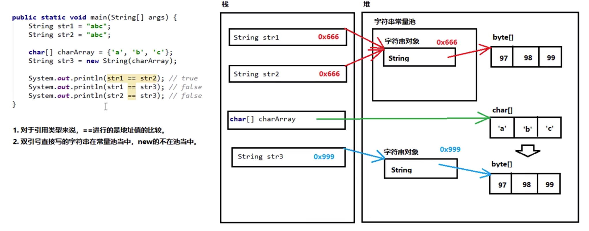

# 第一章 字符串
## 1.1 字符串的概念和特点
`demo01.Demo01String`
* java.lang.String类代表字符串
* API当中说：java程序中的所有字符串字面值(如"abc")都作为此类的实例实现。
* 其实就是说：程序当中所有的双引号字符串，都是String类的对象。（就算没有new，也照样是）
* 字符串的特点：
    *  1.字符串的内容永不可变。【重点】
    *  2.正是因为字符串不可变，所以字符串是可以共享使用的。
    *  3.字符串效果上相当于是char[]字符数组，但是底层原理是byte[]字节数组
## 1.2 字符串的构造方法和直接创建
`demo01.Demo01String`
* 创建字符串的3+1种方式：
    *  三种构造方法:
 *      public String(); 创建一个空白字符串，不含有任何字符
 *      public String(char[] array); 根据字符数组内容，来创建对应的字符串
 *      public String(byte[] array); 根据字节数组的内容，来创建对应的字符串
    *  一种直接创建:
 *      String str = "Hello"; // 右边直接用双引号
    *  注意：
 *      直接写上双引号就是字符串对象。
## 1.3 字符串常量池
`demo01.Demo02StringPool`
* 字符串常量池：程序中直接写上双引号的字符串，就在字符串常量池中
* 对于基本类型来说：==是进行数值的比较
* 对于引用类型来说：==是进行【地址值】的比较

## 1.4 字符串的比较方法
- ==是进行地址值的比较，如果需要字符串的内容比较可以使用两个方法：
    + 1.public boolean equals(Object obj); 参数可以是任何对象，只有参数是一个字符串
    并且内容相同才会返回true，否则返回false
        * 备注：任何对象都能用Object接收
 # 137