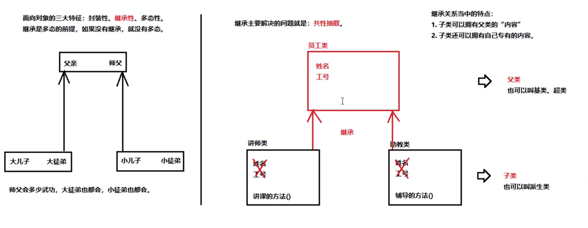

# 第一章 继承
## 1.1 基本概念

## 1.2 继承的格式
`demo01.Demo01Extends`
- 在继承的关系中，"子类就是一个父类"。也就是说子类可以被当做父类看待
    + 例如父类是员工，子类是讲师，那么"讲师就是一个员工"。关系：is-a
```
* 定义父类的格式：（一个普通的类定义）
* public class 父类名称 {
*     // ...
* }
* 定义子类格式
* public class 子类名称 extends 父类名称 {
*     // ...
* }
```
## 1.3 继承中成员变量访问的特点
`demo02.Demo01ExtendsField`
- 在父子类的继承关系中，如果成员变量重名，则创建子类对象时，访问有两种方式：
    + 直接通过子类对象访问成员变量：等号左边是谁，就优先用谁，没有则向上找。
    + 间接通过成员方法访问成员变量：方法属于谁就优先用谁，没有就向上找。
## 1.4 区分子类方法中重名的三种变量
`demo03.Demo01ExtendsField`
* 局部变量：        直接写成员变量名
* 本类的成员变量：   this.成员变量名
* 父类的成员变量：   super.成员变量名
## 1.5 继承中成员方法访问的特点