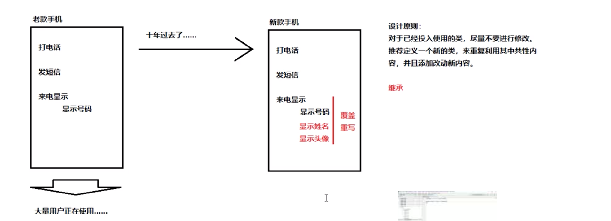
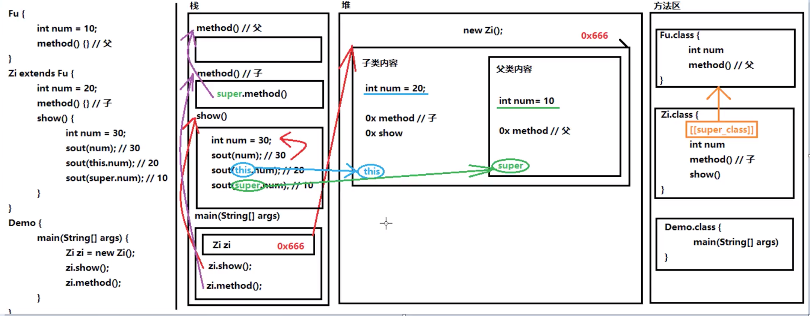
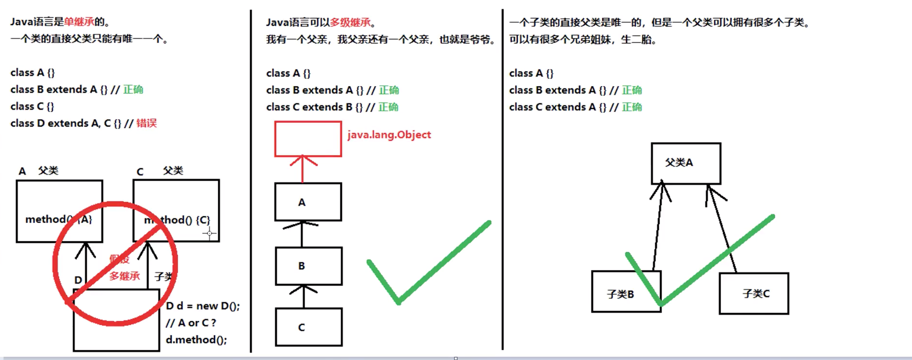
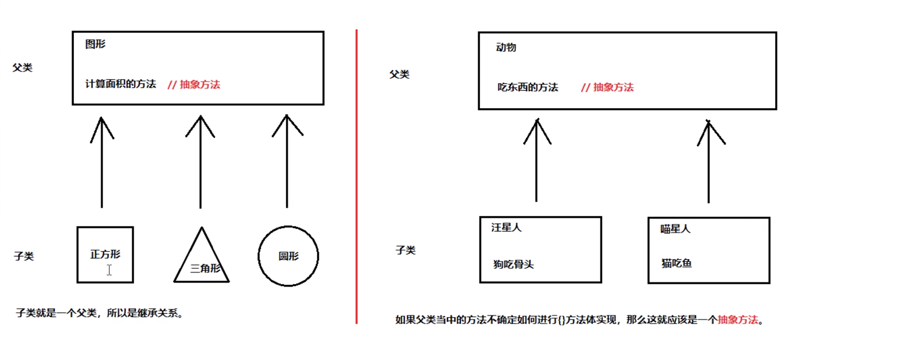

# 第一章 继承
## 1.1 基本概念

## 1.2 继承的格式
`demo01.Demo01Extends`
- 在继承的关系中，"子类就是一个父类"。也就是说子类可以被当做父类看待
    + 例如父类是员工，子类是讲师，那么"讲师就是一个员工"。关系：is-a
```
* 定义父类的格式：（一个普通的类定义）
* public class 父类名称 {
*     // ...
* }
* 定义子类格式
* public class 子类名称 extends 父类名称 {
*     // ...
* }
```
## 1.3 继承中成员变量访问的特点
`demo02.Demo01ExtendsField`
- 在父子类的继承关系中，如果成员变量重名，则创建子类对象时，访问有两种方式：
    + 直接通过子类对象访问成员变量：等号左边是谁，就优先用谁，没有则向上找。
    + 间接通过成员方法访问成员变量：方法属于谁就优先用谁，没有就向上找。
## 1.4 区分子类方法中重名的三种变量
`demo03.Demo01ExtendsField`
* 局部变量：        直接写成员变量名
* 本类的成员变量：   this.成员变量名
* 父类的成员变量：   super.成员变量名
## 1.5 继承中成员方法访问的特点
```java
/**
 * Demo01ExtendsMethod
 * 继承中成员方法访问特点
 * @author wss
 * @date 2020/9/7 1:57 下午
 * 在父子类的继承关系中，创建子类对象，访问成员方法规则
 *      创建的对象是谁，就优先用谁，如果没有则向上找
 * 注意事项：
 *  无论成员方法还是成员变量，如果没有都是向上找父类，绝对不会向下找子类的。
 *
 * 重写(Override)
 * 概念：在继承关系当中，方法和名称一样，参数列表也一样
 *
 * 重写(Override): 方法的名称一样，参数列表【也一样】。覆盖，覆写。
 * 重载(Overload): 方法和名称一样，参数列表【不一样】。
 * 方法覆盖重写特点，创建的是子类对象，则优先使用子类方法。
 * 方法覆盖重写的注意事项：
 *  1.必须保证父子类当中的方法的名称相同，参数列表也相同。
 *      @Override,写在方法的前面，用来检测是不是有效的正确覆盖重写
 *      这个注解就算不写，只要满足要求，也是正确的方法覆盖重写。
 *  2.子类方法的返回值必须【小于等于】父类方法的返回值范围。
 *      前提：java.lang.Object类是所有类的公共最高父类（祖宗类），java.long.String 是 Object 的子类
 *  3.子类方法的权限必须【大于等于】父类方法的权限修饰符
 *      小扩展提示：public > protected > (default) > private
 *      备注：（default）不是关键字default，而是什么都不写，留空
 */
```
   - 继承方法中覆盖重写的应用场景
   
 ## 1.6 继承中构造方法的访问特点
  * 子类构造方法当中有一个默认的"super()"调用，所以一定是先调用的父类构造，后执行子类构造
  * 可以通过super()关键字在子类构造调用父类重载的构造
  * super的父类构造调用，必须是子类构造方法的第一个语句。不能一个子类调用多次super()构造
  总结
  *  子类必须调用父类构造方法，不写则赠送super()，写了则用写的指定的super调用，super有且仅有一个
 ## 1.7 super关键字的三种用法
  * 在子类的成员方法中，访问父类的成员变量。
  * 在子类的成员方法中，访问父类的成员方法。
  * 在子类的构造方法中，访问父类的构造方法。
 ## 1.8 this关键字的三种用法
  -  在本类成员方法中，访问本类的成员变量。
  -  在本类的成员方法中，访问本类的另一个成员方法
  -  在本类的构造方法中，访问本类的另一个构造方法
  -  在第三种方法中要注意：
   * this(...)调用也必须是构造方法的第一个语句，唯一一个
   * super和this两种构造调用，不能够同时使用
 ## 1.9 super与this关键字图解
 
 ## 2.0 Java继承的3个特点
 - Java语言是单继承的：一个类的直接父类只有唯一一个。
 - Java语言可以是多继承：我有一个父亲，我父亲还有一个一个父亲，也就是爷爷。
 - 子类的直接父类是唯一的，但是一个父亲可以拥有多个子类，可以有很多个兄弟姐妹
 
 ## 2.1 抽象的概念
 
 ## 2.2 抽象方法和抽象类
 ### 2.2.1 格式
 `demo11.Animal`
 ### 2.2.2 使用
 `demo11.Animal`
 ### 2.2.3 注意事项
 - 抽象类不能创建对象，如果创建，编译无法通过而报错。只能创建其非抽象子类的对象。
 > 理解：假设创建了抽象类的对象，调用抽象的方法，而抽象方法没有具体的方法体，没有意义
 - 抽象类中，可以有构造方法，是供子类创建对象时，初始化父类成员使用的。
 > 理解：子类的构造方法中，有默认的super()，需要访问父类的构造方法
 - 抽象类中不一定有抽象方法，有抽象方法的一定是抽象类。
 > 理解：未包含抽象方法的抽象类，目的就是不想让调用者创建该类对象，通常用于某些特殊的类结构设计。
 - 抽象类的子类，必须重写抽象父类中的所有的抽象方法，否则，编译不法通过而报错，除非该子类也是抽象类。
 > 理解：假设不重写所有抽象方法，则类中可能包含抽象方法，那么创建对象后，调用抽象的方法，没有意义
 ## 第三章 继承的综合案例
 ### 3.1 综合案例：群主发普通红包
 > 群主发普通红包，某群有多名成员，群主给成员发普通红包，普通红包的规则：
>
> 1.群主的一笔金额
 